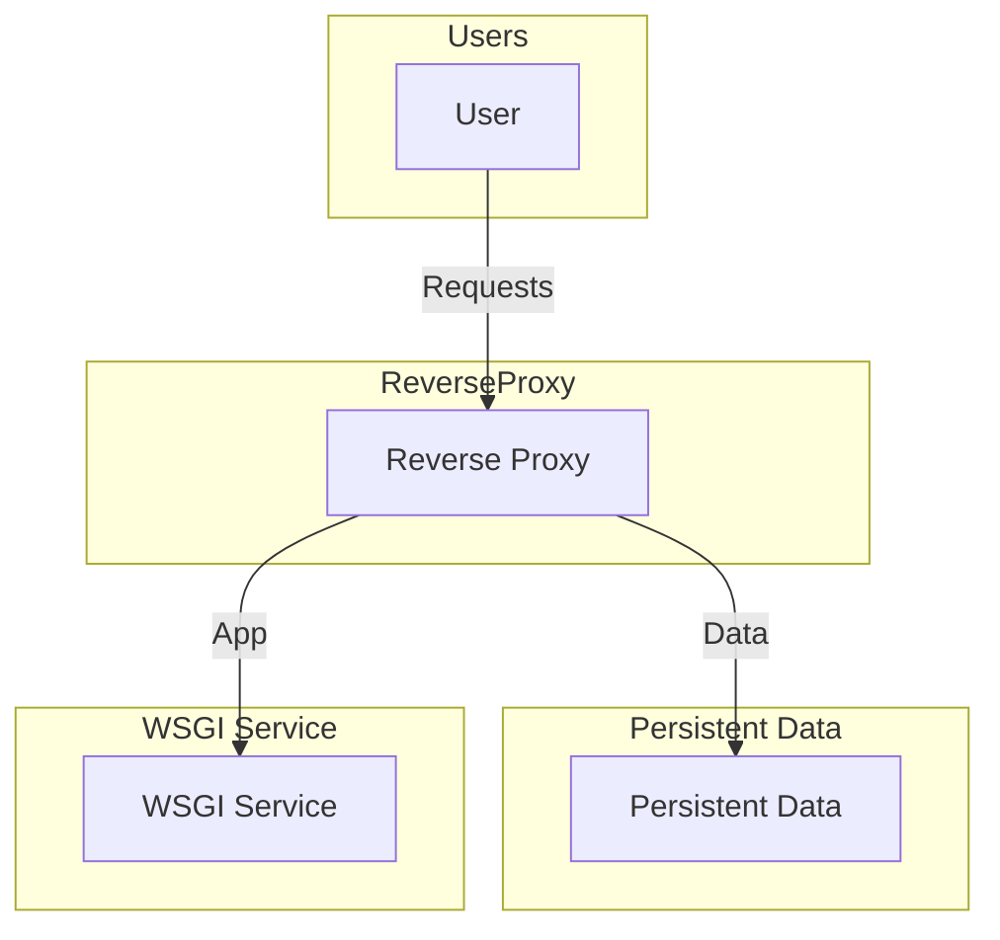
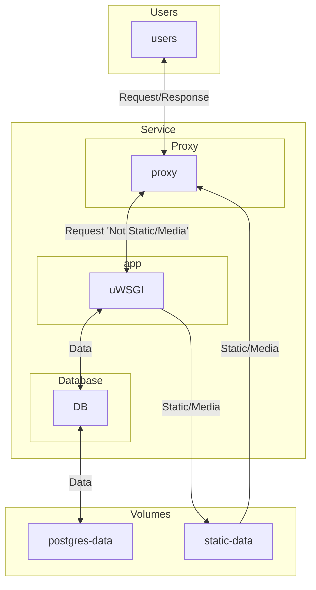

# Deployment in Django

## Reverse Proxy

1. WSGI good at serving python but not data
2. nginx - open source, fast, secure, production grade
3. uWSGI - open source, fast, lightweight, simple to use
4. Docker Compose - Pulls it all together

### Docker Compose Setup

## Handling Configuration

1. Environment variables
   1. .env file on server
   2. Set values in Docker Compose
2. Secret managers

## Using AWS

1. Hosting
2. Keep account secure (Follow Best Practices - MFA, Strong Password, Do Not Share Account)
